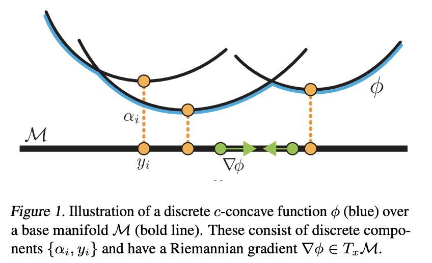

# Riemannian Convex Potential Maps

This repository is by
[Brandon Amos](http://bamos.github.io),
[Samuel Cohen](https://samcohen16.github.io/)
and
[Yaron Lipman](http://www.wisdom.weizmann.ac.il/~ylipman/)
and contains the [JAX](https://jax.readthedocs.io/en/latest/)
source code to reproduce the
experiments in our ICML 2021 paper on
[Riemannian Convex Potential Maps](https://arxiv.org/abs/2106.10272).


> Modeling distributions on Riemannian manifolds is a crucial
> component in understanding non-Euclidean data that arises, e.g., in
> physics and geology. The budding approaches in this space are
> limited by representational and computational tradeoffs. We propose
> and study a class of flows that uses convex potentials from
> Riemannian optimal transport. These are universal and can model
> distributions on any compact Riemannian manifold without requiring
> domain knowledge of the manifold to be integrated into the
> architecture. We demonstrate that these flows can model standard
> distributions on spheres, and tori, on synthetic and geological
> data.


</img>

# Reproducing our experiments

[config.yaml](config.yaml) contains the basic config for
setting up our experiments.
We currently use hydra 1.0.3.
By default it contains the options to
reproduce the multimodal sphere flow:

</img>
</img>

This can be run with:

```
$ ./main.py
workspace: /private/home/bda/repos/rcpm/exp_local/2021.06.21/053411
Iter 1000 | Loss -10.906 | KL 0.017 | ESS 96.74% | 9.54e-02s/it
Iter 2000 | Loss -10.908 | KL 0.013 | ESS 97.43% | 1.90e-02s/it
Iter 3000 | Loss -10.911 | KL 0.012 | ESS 97.71% | 1.75e-02s/it
Iter 4000 | Loss -10.912 | KL 0.010 | ESS 98.02% | 1.63e-02s/it
Iter 5000 | Loss -10.912 | KL 0.009 | ESS 98.19% | 1.46e-02s/it
...
Iter 30000 | Loss -10.915 | KL 0.006 | ESS 98.75% | 1.78e-02s/it
```

This will create a work directory in `exp_local` with
the models and debugging information.
You can use
[plot-components.py](plot-components.py)
to further analyze the components of the learned flow,
and
[plot-demo.py](plot-demo.py)
to produce the grid visualization from Figure 2
of our paper.

# Other JAX sphere flow library
[katalinic/sdflows](https://github.com/katalinic/sdflows)
provides a great JAX re-implementation of
[Normalizing Flows on Tori and Spheres](https://arxiv.org/abs/2002.02428).

# Citations
If you find this repository helpful for your publications,
please consider citing our paper:

```
@inproceedings{cohen2021riemannian,
  title={{Riemannian Convex Potential Maps}},
  author={Cohen*, Samuel and Amos*, Brandon and Lipman, Yaron},
  booktitle={ICML},
  year={2021},
}
```

# Licensing
This repository is licensed under the
[CC BY-NC 4.0 License](https://creativecommons.org/licenses/by-nc/4.0/).
